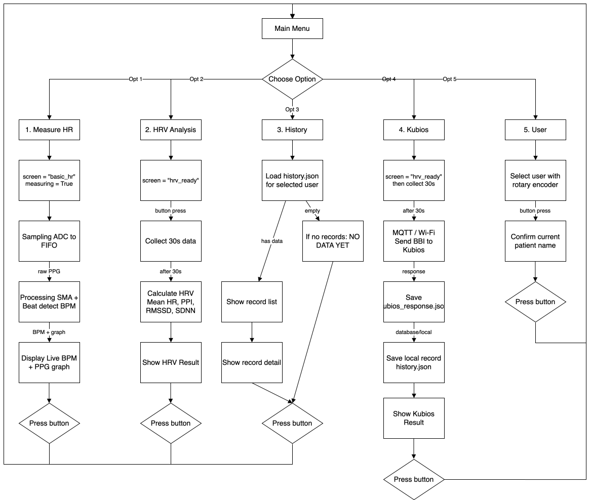

# Hardware-2-Project-Group-1
## Overview
iMuha is a health prototype that measures heart rate and performs Heart Rate Variability (HRV) analysis using Raspberry Pi Pico W and Kubios Cloud.

## Main Features
- Real-time heart rate measurement
- Live PPG graph display on OLED
- User-friendly interface with OLED display
- Heart Rate Variability (HRV) analysis
- Local history storage
- Kubios Cloud integration for advanced HRV analysis

## Installation 

### Hardware Components
- Crowntail Pulse sensor
- Raspberry Pi Pico W
- OLED display (SSD1306 128x64 pixels)
- Grove connector
- USB connector
- Rotary encoder

### Hardware Setup
1. Connect the Crowntail Pulse sensor to GP26 of the board using a Grove connector.
2. Connect the OLED display to GP14 (SCL) and GP15 (SDA).
3. Connect the Rotary Encoder to GP10 (Rot_A), GP11 (Rot_B), and GP9 (SW).
4. Connect the Raspberry Pi Pico W to your computer using the USB connector.

### Software Setup
1. Install `mpremote` in your terminal in case you haven't installed it yet.
   ```bash
   pip install mpremote
   ```
   
   or
   
   ```bash
   python -m pip install mpremote
   ```
   
3. Clone the repository.
   ```bash
   git clone https://github.com/Hung-497/Hardware-2-Project-Group-1.git
   ```
   
4. [Optional] Configure settings:
- Edit the **/lib/config.py** to set up the WiFi: `SSID`, `PASSWORD`, and `BROKER_IP`.
- If you have different pins than the ones specified in the hardware setup, open **/lib/hardware.py** and modify the parameters in **__init__**.

4. Install the required libraries.
   
   For Mac, Linux, or GitBash:
   ```bash
   cd Hardware-2-Project-Group-1 && ./install.sh
   ```

   For Windows PowerShell or cmd:
   ```bash
   cd Hardware-2-Project-Group-1 && .\install.cmd
   ```
   
6. Connect your Raspberry Pi Pico W and check the device name.
   ```bash
   mpremote connect list
   ```
7. Upload the project to the Pico.
   ```bash
   python -m mpremote connect <device name> cp main.py :/main.py
   python -m mpremote connect <device name> cp -r ./lib/ :/lib/
   ```
8. Restart your Raspberry Pi Pico W.

## Usage
Complete the [Installation](#installation) and the device should be ready to use.

## System Architecture

*Program Flowchart*
